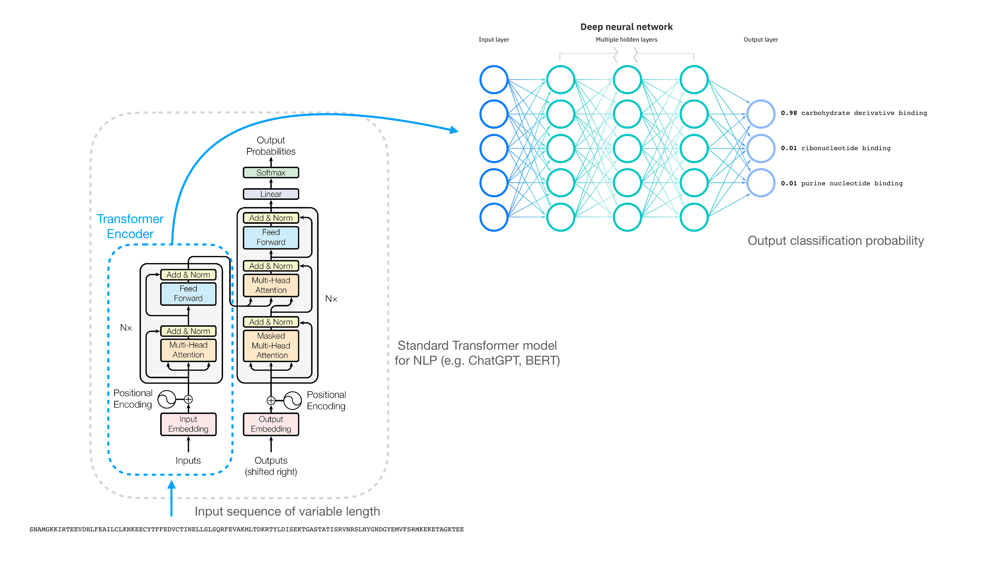

# TransformerFRI


 Single-value classifications across functions of different protein given sequence-only data, using Transformer architecture.

 ## System Setup

This project requires:

- **Python 3.11**
- **pip**

Ensure the above are installed on your system:  

- [Download Python 3.11](https://www.python.org/downloads/release/python-3110/)  

Verify installation:
>```bash
>python3 --version
   pip --version
>```

## Environment and Installation

> **Important:** The Python environment must be set up before installing dependencies or running the pipeline.

1. Create and activate a Python environment: 
>```bash
>python3.11 -m venv transformerfri-env 
>source transformerfri-env/bin/activate
>```

2. Upgrade pip:
>```bash
>pip install --upgrade pip
>```

3. Clone the repository in your chosen directory:
>```bash
>git clone https://github.com/Alki-A/TransformerFRI.git
>cd TransformerFRI
>```

4. Install Snakemake:
>```bash
>pip install snakemake==9.11.2
>```

5. Install project dependencies:
>```bash
>pip install -r requirements.txt
>```

 ## Usage

In order to run the pipeline, Snakemake can be used as follows:
>```bash
>snakemake --cores <N>
>``` 
where \<N\> is the number of CPU cores allocated.

   ### Notes on usage
   The pipeline defaults to **2 epochs** for quick testing and demonstrating viability of code with a CPU alone.
   For meaningful results, use **~200 epochs** on a GPU-enabled system or HPC server.

   ## Outputs After running the pipeline, you will see:
   - data/model.h5 → trained model
   - data/dataset_train/ → training dataset in TF format 
   - data/dataset_val/ → validation dataset in TF format 
   - Preprocessed and vectorized .pkl files in data/

   ## Workflow Summary 
   1. Set up Python environment 
   2. Upgrade pip 
   3. Clone the repo 
   4. Install Snakemake 
   5. Install requirements 
   6. Run Snakemake pipeline (--cores <N>) 
   7. Collect outputs in data/